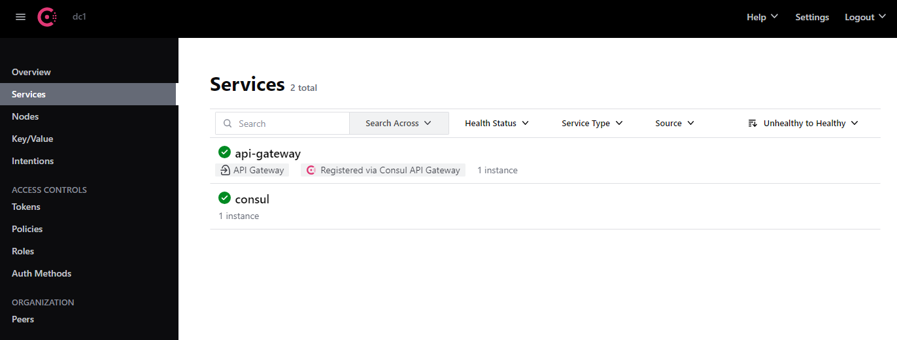

# Consul

I have previously used consul for on prem and cloud workloads and have found it to be a very useful tool for service 
discovery and configuration management. This is a collection of notes and manifests to run consul in kubernetes.

It is mostly based on https://developer.hashicorp.com/consul/tutorials/get-started-kubernetes. All the commands are 
written from the perspective of running them from this consul directory.

## Install

### pre-requisites
We will use the helm chart to install consul. We will use the values-v2.yaml file to configure the installation. In order
for the helm chart to work we need to ensure there is a default storage class in the cluster. We can check this by running
the following command.

```bash
kubectl get storageclass
```

Since I have been doing this on a local k8 cluster on a VPS I needed to configure a local storage class. I used the 
following manifest to create a local storage class.

```yaml
apiVersion: storage.k8s.io/v1
kind: StorageClass
metadata:
  name: local-storage
  annotations:
    storageclass.kubernetes.io/is-default-class: "true"
provisioner: kubernetes.io/no-provisioner
volumeBindingMode: WaitForFirstConsumer
```

I am using a default storage class with no provisioner and the helm chart will create the necessary persistent
volume claim and expect the storage class provisioner to create the volume. Since my storage class doesn't have a
provisioner the volume will not be created and the consul server pod will not start. I will need to create the volume 
manually.

```bash
mkdir -p /mnt/local-storage
chmod 777 /mnt/local-storage
```

```yaml
apiVersion: v1
kind: PersistentVolume
metadata:
  name: local-pv
spec:
  capacity:
    storage: 10Gi
  accessModes:
    - ReadWriteOnce
  storageClassName: local-storage
  local:
    path: /mnt/local-storage
  nodeAffinity:
    required:
      nodeSelectorTerms:
        - matchExpressions:
            - key: kubernetes.io/hostname
              operator: In
              values:
                - vps-b21d2eed
```

### helm
Now that we have the storage setup we can run the helm chart to deploy the consul resources

```bash
helm repo add hashicorp https://helm.releases.hashicorp.com
helm install --values helm/values.yaml consul hashicorp/consul --create-namespace --namespace consul --version "1.2.0"
```

## Usage
Now everything is installed we should be able to look up the nodePort that the consul UI is running on and using the 
nodes IP with the node port we should be able to access the consul UI.

```bash
kubectl get service -n consul consul-ui -o=jsonpath='{.spec.ports[?(@.name=="https")].nodePort}{"\n"}';
```

## Bootstrap token
In order to log in to consul we can fetch the bootstrap token from the kubernetes secret. You can use the token to login 
to the consul UI.

```bash
kubectl get secrets -n consul consul-bootstrap-acl-token -o jsonpath="{.data.token}" | base64 --decode; echo
```

## api-gateway
Once we start using the service mesh we will need a way to get traffic in to the mesh. We can use the api-gateway for 
that. We will deploy the API gateway, reference grant and RBAC resources now so that later on we just need to configure
routes and service intentions.

```bash
kubectl apply -f api-gw/
```

## Final Check
All being well you should see resources similar to below in the consul namespace

```bash
NAME                                              READY   STATUS    RESTARTS   AGE
pod/api-gateway-7594c75d68-hcv7r                  1/1     Running   0          5m34s
pod/consul-connect-injector-79c58d57c6-nxfsz      1/1     Running   0          18m
pod/consul-server-0                               1/1     Running   0          18m
pod/consul-webhook-cert-manager-88b755bd7-sjd9h   1/1     Running   0          18m

NAME                              TYPE        CLUSTER-IP       EXTERNAL-IP   PORT(S)                                                                            AGE
service/api-gateway               NodePort    10.101.240.151   <none>        80:31948/TCP                                                                       5m35s
service/consul-connect-injector   ClusterIP   10.96.127.134    <none>        443/TCP                                                                            18m
service/consul-dns                ClusterIP   10.96.196.8      <none>        53/TCP,53/UDP                                                                      18m
service/consul-server             ClusterIP   None             <none>        8501/TCP,8502/TCP,8301/TCP,8301/UDP,8302/TCP,8302/UDP,8300/TCP,8600/TCP,8600/UDP   18m
service/consul-ui                 NodePort    10.107.181.53    <none>        443:31299/TCP                                                                      18m

NAME                                          READY   UP-TO-DATE   AVAILABLE   AGE
deployment.apps/api-gateway                   1/1     1            1           5m35s
deployment.apps/consul-connect-injector       1/1     1            1           18m
deployment.apps/consul-webhook-cert-manager   1/1     1            1           18m

NAME                                                    DESIRED   CURRENT   READY   AGE
replicaset.apps/api-gateway-7594c75d68                  1         1         1       5m35s
replicaset.apps/consul-connect-injector-79c58d57c6      1         1         1       18m
replicaset.apps/consul-webhook-cert-manager-88b755bd7   1         1         1       18m

NAME                             READY   AGE
statefulset.apps/consul-server   1/1     18m
```

you should also be able to reach the UI and log in with the bootstrap token.
