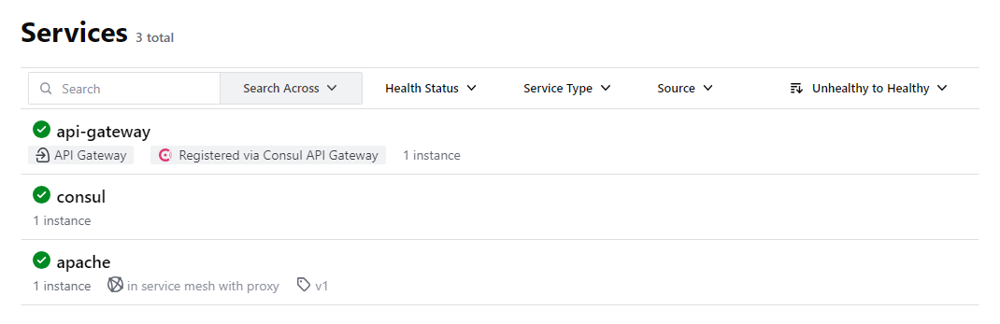
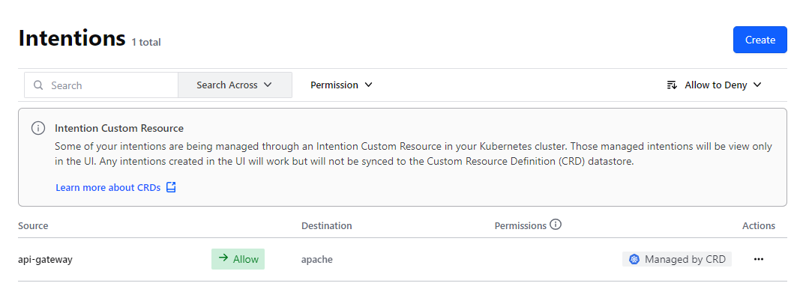
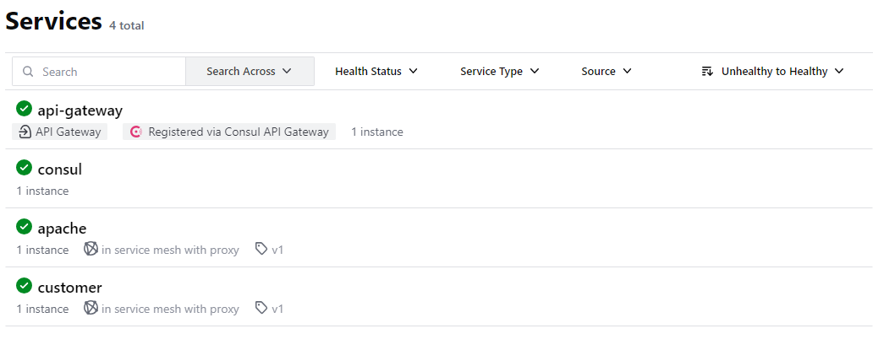
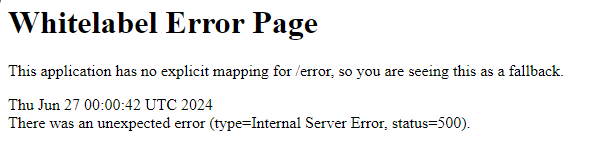
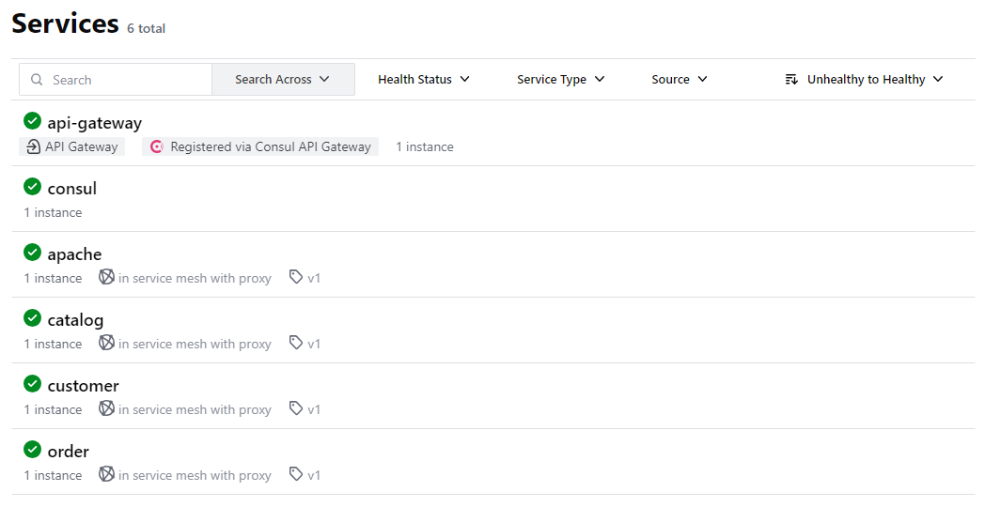
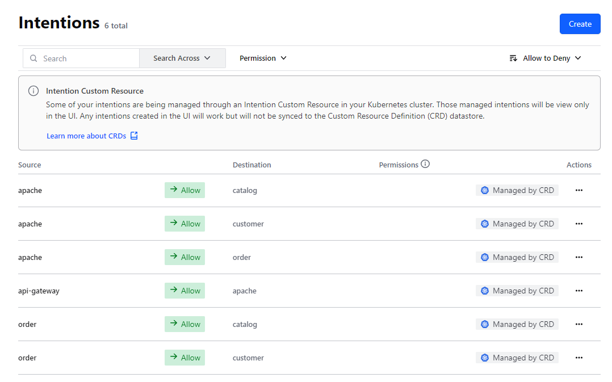

# consul connected microservices on Kubernetes
This directory contains the manifest files to deploy the microservices on kubernetes with consul connect. We will run 
these on top of the originally deployed vanilla microservices. some of the key changes are:

1. The services are annotated with `consul.hashicorp.com/connect-inject: "true"` to enable consul connect sidecar injection.
2. Each service gets a service account created and the pod runs with that service account.
3. Each service defines a serviceDefaults for its protocol
4. Each service defines serviceIntentions to allow traffic between services

While we could run an apply on the entire dir and put all services in to the mesh at the same time we will apply them 
one by one to see the changes in the UI as we go along. We will also run in to an error and learn why it happened and
how to solve it.

## Apache
The apache service is the entry point to the application. It is a simple web server that serves a static page and a 
reverse proxy for the other services. this was previously deployed as a NodePort service. We will now deploy it as a
ClusterIP service and expose it to the outside world using consuls api-gateway.

we need to apply the apache manifest and the http route for the consul api gateway:
```bash
kubectl apply -f microservices-consul-k8/apache.yaml -n demo-app
kubectl apply -f microservices-consul-k8/api-gateway-http-routes.yaml -n demo-app
```

We should now see the service is active and healthy in the consul cluster and in the service mesh. We can also see
that service intentions allow traffic from the api-gateway to the apache service




If you now try to access the apache service via the node port for the consul api gateway you should see the microservice
UI as before. The difference now is that the traffic is going to apache is routed from the api-gateway through the 
service mesh to the apache instance. This ensures both authentication and encryption of the traffic. 

Traffic from the apache service to the other services in the cluster at this point are still using http and not part of 
the service mesh.

## Customer
The next service we will on board is the customer service. After applying we now see the service is active and healthy 
and also in the service mesh

```bash
kubectl apply -f microservices-consul-k8/customer.yaml -n demo-app
```



One thing to remember is that the purpose of the service mesh is to secure the traffic with Mtls and ensure authentication
and authorization between services. This means that since the order service is not in the service mesh yet, when it trys
to talk to the customer service it will fail. 


```none
2024-06-27 00:02:04.240 TRACE 7 --- [nio-8080-exec-2] c.e.m.order.clients.CatalogClient        : Catalog: URL http://10.97.191.86:8080/catalog/
2024-06-27 00:02:04.279 TRACE 7 --- [nio-8080-exec-2] c.e.m.order.clients.CustomerClient       : Customer: URL http://10.99.248.140:8080/customer/
2024-06-27 00:02:04.292 ERROR 7 --- [nio-8080-exec-2] o.a.c.c.C.[.[.[/].[dispatcherServlet]    : Servlet.service() for servlet [dispatcherServlet] in context with path [] threw exception [Request processing failed; nested exception is org.springframework.web.client.ResourceAccessException: I/O error on GET request for "http://10.99.248.140:8080/customer/": Unexpected end of file from server; nested exception is java.net.SocketException: Unexpected end of file from server] with root cause
```

to resolve this we would either need to expose the customer service via the api-gateway or put the order service in to the
service mesh. We will do the latter.

## Remaining services
We will now onboard the remaining services in to the service mesh. We will do this by applying the entire manifest dir

```bash
kubectl apply -f microservices-consul-k8/ -n demo-app
```

We can now see all services in the mesh and the list of intentions


